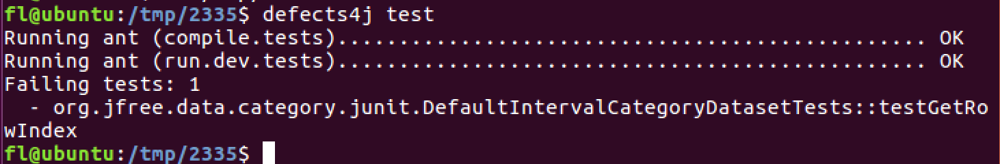

# How to Reproduce the Case Study?

This section demonstrates how to reproduce the case study using Chart-16 as an example.

---

## Steps to Reproduce

1. **Checkout the Defects4J Project**  
   Run the following command to checkout the Chart-16 project:
   ```bash
   defects4j checkout -p Chart -v 16f -w /tmp/2335

2. **Replace the Source File**  
   Replace the original source file with the mutant file.
   You can find the mutant's path by its name. For example:
   ```bash
   cp ./Chart16/56-.-source-org-jfree-data-category-DefaultIntervalCategoryDataset.java /tmp/2335/source/org/jfree/data/category/DefaultIntervalCategoryDataset.java

3. **Run the test**  
   Navigate to the project directory and execute the tests:
   ```bash
   cd /tmp/2335
   defects4j test


   
## Result

After running the above commands, you will see output similar to the following:



To see the triggering test cases:
   ```bash
   cd /tmp/2335
   cat defects4j.build.properties
```   

it will shows:
```
......
d4j.tests.trigger=org.jfree.data.category.junit.DefaultIntervalCategoryDatasetTests::testGetCategoryIndex,
org.jfree.data.category.junit.DefaultIntervalCategoryDatasetTests::testSetCategoryKeys,
org.jfree.data.category.junit.DefaultIntervalCategoryDatasetTests::testGetSeriesIndex,
org.jfree.data.category.junit.DefaultIntervalCategoryDatasetTests::testGetRowCount,
org.jfree.data.category.junit.DefaultIntervalCategoryDatasetTests::testGetRowIndex,
org.jfree.data.category.junit.DefaultIntervalCategoryDatasetTests::testGetColumnCount,
org.jfree.data.category.junit.DefaultIntervalCategoryDatasetTests::testGetColumnIndex,
org.jfree.data.category.junit.DefaultIntervalCategoryDatasetTests::testCloning2
```

## Additional Notes
If you want to see the results for all mutants, refer to runMutant.py for further automation and insights.